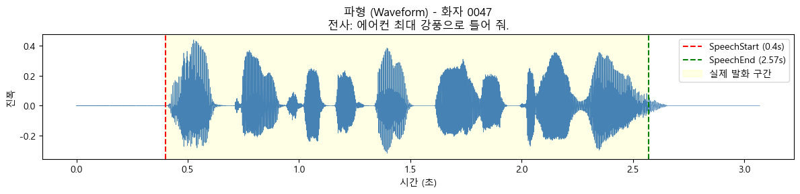
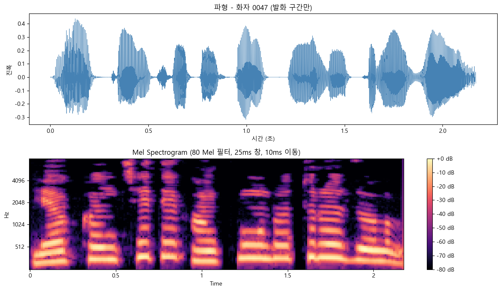
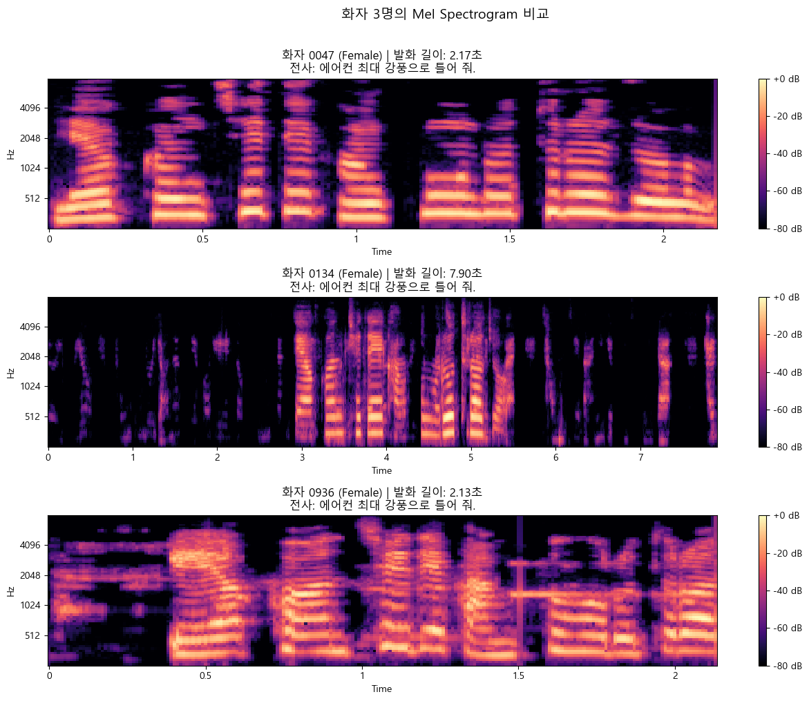
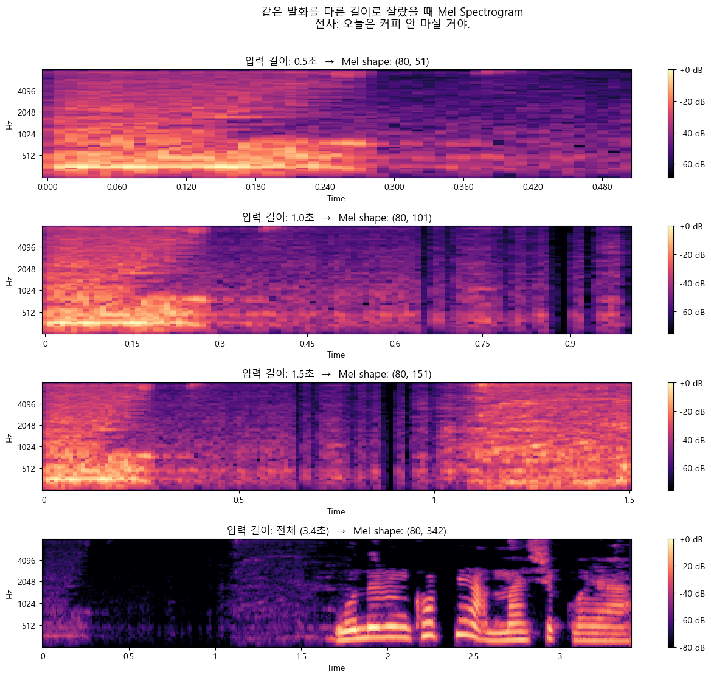

# 01. EDA — 데이터 탐색 및 시각화

> **파일**: `notebooks/01_eda_visualization.ipynb`
>
> EDA(Exploratory Data Analysis, 탐색적 데이터 분석)란 모델 학습 전에 데이터가 어떻게 생겼는지, 어떤 특성을 가지는지 직접 눈으로 확인하는 단계이다.


---

## 1. 배경 지식: 소리는 무엇인가?

### 소리와 파형
소리는 공기의 진동이다. 마이크는 이 진동의 세기(진폭, amplitude)를 초당 수천 번 측정해서 숫자로 저장한다

```
시간:   0ms   0.0625ms  0.125ms  ...
진폭: [0.001, -0.002,   0.003,  ...]
```

=> WAV 파일은l 이러한 숫자들의 나열

### 샘플링 레이트 (Sampling Rate, SR)
초당 몇 번 측정하는지를 나타냄. 이 프로젝트에서는 **SR = 16,000 Hz (16kHz)** 를 사용.

- 1초짜리 음성 = 16,000개의 숫자
- 3초짜리 음성 = 48,000개의 숫자
- 나이퀴스트 정리에 의하면, 어떤 주파수 성분을 제대로 표현하려면 그 주파수보다 최소 2배 빠르게 샘플링 해야 함. -> 이 때는 8000Hz까지의 소리 성분을 이론적으로 정확하게 표현 가능.

> **16kHz를 선택한 이유** 사람 말소리의 핵심 정보는 대부분 8kHz 이하에 있다. 전화 음성 품질 기준이 8kHz이고, 8kHz까지 표현하려면 16kHz 샘플링이 필요하다.

### 주파수와 음색
소리는 한 순간에 여러 주파수가 동시에 섞여 있음.

- **기본 주파수(F0, Fundamental Frequency)**: 성대가 초당 몇 번 진동하는지. 성인 여성 약 200~250Hz, 남성 약 100~150Hz
- **배음(Harmonics)**: F0의 정수배(2F0, 3F0, ...). 음색을 결정
- **포먼트(Formants)**: 특정 주파수 대역이 특히 강하게 울리는 부분. 사람이 말을 할 때 성대에서 나온 소리가 성도(목, 입)을 지나면서 어떤 주파수는 더 크게 즈폭되는데, 이는 모음 구분에 중요하다.

파형 그래프는 F0, 배음, 포먼트 같은 주파수 성분을 따로따로 보여주는 그래프가 아니라, 그것들이 전부 합쳐진 최종 소리 모양을 시간에 따라 한 줄로 보여주는 그래프이다.

---

## 2. 데이터 구조 파악

### 파일 구조
```
New_Sample/
├── 원천데이터/TS_common_01/{날짜}/{화자ID}/*.wav    ← 음성 파일
└── 라벨링데이터/TL_common_01/{날짜}/{화자ID}/*.json ← 메타 정보 (데이터에 관한 설명)
```

WAV 파일과 JSON 파일은 파일명이 동일하고, 확장자만 다름.

### JSON 메타데이터 구조
```json
{
  "Speaker": {
    "Gender": "Female",
    "Age": "20~59"
  },
  "Transcription": {
    "LabelText": "에어컨 최대 강풍으로 틀어 줘."
  },
  "Other": {
    "SpeechStart": "0.4",   ← 발화 시작 시점
    "SpeechEnd": "2.57",    ← 발화 종료 시점
    "QualityStatus": "Good"
  },
  "File": {
    "FileName": "B0001-0047F1111-106001_0-00018869.wav",
    "FileLength": "3.07"    ← 전체 파일 길이
  }
}
```

이때 WAV 파일의 앞뒤에는 무음 구간이 있으므로 실제 학습에 쓰이는 구간은 `SpeechStart` ~ `SpeechEnd` 구간만이다.

### 헬퍼 함수
(헬퍼 함수란: 메인 기능을 구현할 때 반복되거나 복잡한 작은 작업을 따로 빼서 만든 보조함수)

#### `load_wav_and_json(date, speaker_id, file_index)`
- 특정 화자의 특정 번째 파일을 읽어 반환
- 반환값: `(wav 배열, 샘플링레이트, 메타데이터 딕셔너리)`

---

## 3. 파형(Waveform) 시각화

### 코드 동작
```python
time_axis = np.arange(len(wav)) / sr    # 샘플 번호 → 초 단위로 변환
ax.plot(time_axis, wav, linewidth=0.5)  # X=시간, Y=진폭
ax.axvline(x=speech_start, color='red')    # 발화 시작선
ax.axvline(x=speech_end,   color='green')  # 발화 종료선
ax.axvspan(speech_start, speech_end, alpha=0.1)  # 발화 구간 강조
```

### 그래프 해석



- 발화 구간 전후의 평평한 구간 = 무음 (소음이 거의 없음)
- 발화 구간의 진폭 변동 = 말소리의 강약

---

## 4. Mel Spectrogram 변환 및 시각화

사람마다 목소리를 구별해 주는 것은 목소리의 크기가 아닌 주파수의 구성이다. 즉 파형은 소리가 얼마나 큰가만 보여주는 반면, 화자 구분에는 어떤 주파수가 얼마나 강한가가 더 중요하다. 이를 2D로 표현한 것이 **Spectrogram**이다. 여기서 Spectogram이란 소리나 다양한 파동을 시각화하여 나타낸 2차원 그래프이다.

### STFT (Short-Time Fourier Transform, 단시간 푸리에 변환)

**배경**: 푸리에 변환이란 복잡한 입력 신호를 다양한 주파수를 갖는 주기함수들의 합으로 표현하는 것이다. 단 전체 신호에 대해 한 번만 푸리에 변환을 취했을 때(FTT)는 시간 정보를 잃는다는 문제가 있다.

이를 해결하는 방법이 STFT이다. 전체 음성을 짧은 창(window)으로 나눈 뒤, 각 창에 FFT를 적용한다.

```
※ 샘플링 레이트 ST = 16kHz

파라미터:
  n_fft = 400   → 창 크기: 400샘플 = 400/16000 = 25ms
  hop_length = 160 → 이동 크기: 160샘플 = 160/16000 = 10ms
```

즉, **매 10ms마다 25ms 구간을 분석**하는 것이다.

파라미터를 이처럼 설정한 이유는 Kaldi의 공식 문서를 참고하였다. Kaldi는 자동 음성 인식 시스템을 개발하는 데 알고리즘, 툴 등을 제공하는 오픈소스 소프트웨어 툴킷이다.(https://kaldi-asr.org/doc/feat.html?utm_source=chatgpt.com)
```
Work out the number of frames in the file (typically 25 ms frames shifted by 10ms each time).
```

### Mel 스케일 (Mel Scale)

**배경**: 사람 귀가 느끼는 주파수 간격은 저주파에서 더 민감하다. 예를 들어 같은 100Hz 차이라도 고주파일 때 5000Hz/5100Hz 차이보다 저주파일 때 100Hz/200Hz 차이를 더 민감하게 받아들인다. 즉, 비선형적으로 차이를 받아들인다는 것이다.<br/>
Mel 스케일은 사람 귀가 느끼는 주파수 간격에 맞게 Hz를 다시 배치한 척도이다.

참고: https://librosa.org/doc/main/generated/librosa.mel_frequencies.html?utm_source=chatgpt.com

```
Hz:  100  200  400   1000  2000  4000  8000
Mel: 150  250  400    900  1350  1900  2840  (대략)
  ↓ 낮은 주파수일수록 더 촘촘하게 표현
```

이 프로젝트는 20Hz(사람이 들을 수 있는 최저 주파수) ~ 8000Hz(나이퀴스트 정리에 의해 표현 가능한 최대 주파수) 범위를 **80개의 Mel 필터**로 표현한다. OpenAI의 음성 인식 모델인 Whisper의 v1, v2에서 n_mel을 80으로 사용한 점을 참고하여 그 구간을 Mel 스케일로 80개의 필터로 나누었다.

참고: https://whisperweb.art/blog/openai-whisper-technical-deep-dive

### Power to dB 변환

```python
mel_db = librosa.power_to_db(mel, ref=np.max)
```
헬퍼함수의 librosa.feature.melspectrogram()은 주파수bin의 에너지(파워)를 반환한다. 세기 차이는 값의 범위가 너무 크기 때문에 사람이 보기 편한 로그 단위인 데시벨(dB)로 변환을 한다. 이는 모델이 학습하기에도 편하게 해준다.

### 결과 shape

```
Mel Spectrogram shape: (80, 218)
  → 80  : Mel 필터 수 (주파수 축)
  → 218 : 시간 프레임 수 (발화 길이 2.17초 / 10ms = 217~218 프레임)
```

### 그래프 해석


- X축: 시간
- Y축: 주파수 (아래=저음, 위=고음)
- 색상: 밝을수록(노란/주황) 에너지가 강함, 어두울수록(검정) 약함

---

## 5. 화자 3명 비교

2021-12-16 데이터 파일의 세 화자(0047, 0134, 0936)의 Mel Spectrogram을 같은 파라미터로 비교한다.



### 관찰 포인트
- **에너지 분포 높이**: 저음 화자는 에너지가 하단에 집중되고, 고음 화자는 더 넓게 분포한다.
- **패턴의 세로 줄기**: 각 음절마다 에너지가 강해지는 구간이 나타난다.
- **밝고 어두운 가로 줄무늬**: 특정 주파수 대역(포먼트)이 지속적으로 강한 경우

이 패턴 차이가 바로 모델이 화자를 구분하는 근거이다.

---

## 6. 핵심 실험: 발화 길이별 Mel Spectrogram 비교

이 프로젝트의 핵심 질문은 **발화를 짧게 자르면 화자 구분이 가능한가?**이다.

0047 화자의 같은 발화를 0.5초 / 1.0초 / 1.5초 / 전체로 잘라서 Mel Spectrogram 변화를 관찰한다.

### 코드 동작

```python
durations = [0.5, 1.0, 1.5, full_duration]

for dur in durations:
    wav_cut = trim_wav(wav, speech_start, dur)  # 앞에서 dur초 자르기
    mel_db  = get_mel(wav_cut, sr)               # Mel 변환
    # → 시각화
```

### 관찰 결과



| 입력 길이 | Mel shape | 포함 내용 |
|----------|----------|---------|
| 0.5초    | (80, 50) | 첫 1~2 음절 정도 |
| 1.0초    | (80, 100) | 2~3 음절 |
| 1.5초    | (80, 150) | 전체 발화의 절반 정도 |
| 전체     | (80, T) | 모든 음절 |

- 짧을수록 시간 축(T)이 줄어들지만, **주파수 패턴(80개 Mel 필터)은 동일하게 존재**
- 0.5초에서도 화자 특유의 주파수 분포가 어느 정도 나타남
- 이는 곧 "짧은 음성으로도 화자 구분이 가능한가"를 실험하는 근거

---

## 7. 데이터셋 전체 통계

4,835개 파일 전체를 분석한 결과

### 발화 길이 분포

```
발화 길이별 사용 가능한 샘플 수:
  0.5초 이상: 4,825개 (99.8%)
  1.0초 이상: 4,777개 (98.8%)
  1.5초 이상: 4,301개 (89.0%)
  2.0초 이상: 2,940개 (60.8%)  ← 절반 이상이 탈락

평균 발화 길이: 2.51초
최소: 0.17초, 최대: 8.99초
```

→ 1.5초까지는 실험 카테고리로 쓰기에 적합하다는 결론

### 화자별 샘플 수

- 총 화자: 50명
- 대부분 화자가 137~140개 샘플 보유
- 일부 화자(2057: 1개, 2594: 3개)는 샘플이 극히 적음
- → 전처리 단계에서 **10개 미만 샘플 화자는 제외**

---

## 8. EDA를 통해 내린 결론

| 결정 사항 | 근거 |
|---------|------|
| 실험 duration: 0.5 / 1.0 / 1.5 / full 초 | 2초 이상은 60%만 사용 가능해 **고정 자르기 카테고리**(예: "2.0초")는 만들지 않음. full은 각 발화 전체를 그대로 사용하므로 2초 이상 음성도 모두 포함됨 |
| 최소 발화 길이: 0.5초 | 0.5초 미만은 10개도 안 됨(0.2%) |
| 화자 제외 기준: 10개 미만 | 2057(1개), 2594(3개) 등 학습에 부적합 |
| Mel 필터: 80개 | 음성 인식 표준 모델 기준 |
| 주파수 범위: 20~8000Hz | 16kHz 오디오 유효 범위 = SR/2 = 8000Hz |

다음 단계: → [전처리 (README_02_PREPROCESS.md)](README_02_PREPROCESS.md)
