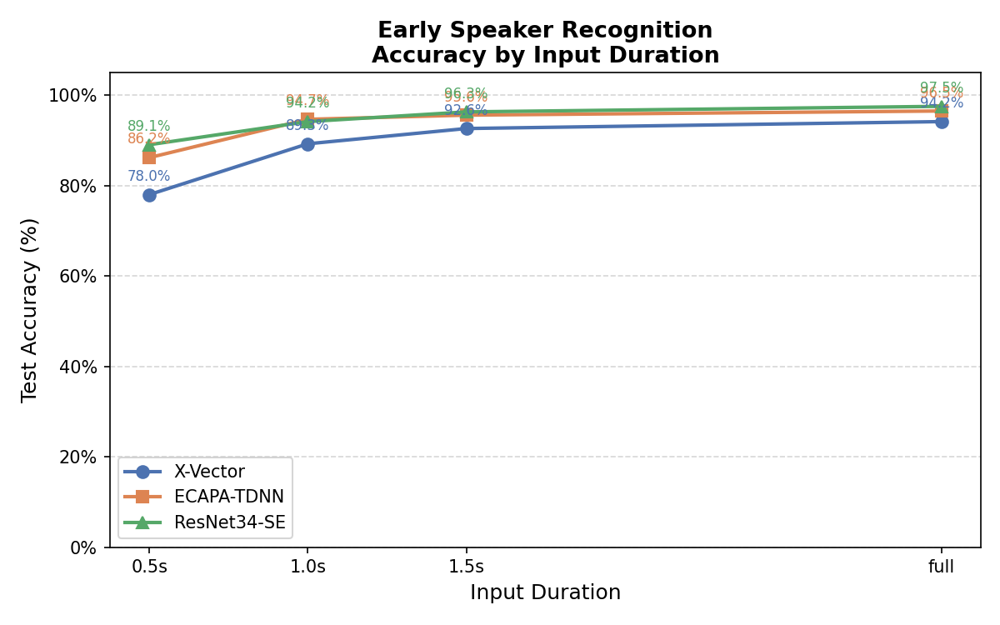

# 04. 평가 및 시각화 (Evaluation & Visualization)

> **파일**: `src/evaluate.py`, `src/visualize.py`
>
> 학습이 끝난 모델의 체크포인트를 불러와 테스트셋으로 정확도를 측정하고, 결과를 그래프로 시각화하는 단계이다. 이 단계는 얼마나 짧은 발화로도 화자 구분이 가능한지라는 프로젝트의 핵심 질문에 답하는 마지막 단계이다.

---

## 1. 배경 지식: 왜 평가를 별도로 분리하는가?

학습 루프 안에서도 매 에폭마다 테스트 정확도를 기록하는데 왜 별도의 평가를 해야할까?

학습 중 기록되는 정확도는 **학습에 사용된 랜덤 duration 조합**에서 측정된 값인데, 이 프로젝트에서는 "0.5초짜리 입력만 주었을 때", "1.0초짜리 입력만 주었을 때"처럼 **각 duration을 독립적으로** 평가해야 하기 때문에 평가 단계에서 duration별로 고정된 테스트셋을 구성해 모델을 평가한다.

---

## 2. 실행 순서

```
python src/evaluate.py      # 1단계: 체크포인트 로드 → duration별 정확도 측정 → JSON 저장
python src/visualize.py     # 2단계: JSON 읽어 그래프 생성 → PNG 저장
```

`visualize.py`는 `evaluate.py`가 생성한 `evaluation_results.json`이 있어야 실행된다.

---

## 3. evaluate.py 동작 원리

### 전체 흐름

```
체크포인트 로드 ({model}_best.pt)
        │
        ▼ duration마다 반복 (0.5 / 1.0 / 1.5 / full)
FixedDurationDataset 구성
        │
        ▼
테스트셋 전체 추론 (분류 헤드 포함)
        │
        ▼
accuracy = 맞은 수 / 전체 수
        │
        ▼ 모든 duration 완료 후
outputs/results/evaluation_results.json 저장
```

구체적으로 설명하면:

* 학습 때 (Train 과정)

샘플마다 0.5/1.0/1.5/full 중 하나를 무작위로 골라서 로드하고, 한 배치 안에 0.5초짜리, 1.5초짜리가 섞여 들어올 수 있다.<br/>
이 섞인 데이터로 모델을 훈련시킨다.

* 평가 때 (Evaluate 과정)

학습 기록을 건드리지 않고, 저장된 _best.pt 체크포인트를 로드해서 학습을 통해 조정된 모델 가중치(W, b 등)를 복원한다. 그 다음 테스트셋을 4번 돌린다. <br/>
-1회: outputs/processed/test/0.5/의 파일들만 로드 → 정확도 측정<br/>
2회: outputs/processed/test/1.0/의 파일들만 로드 → 정확도 측정<br/>
3회: outputs/processed/test/1.5/의 파일들만 로드 → 정확도 측정<br/>
4회: outputs/processed/test/full/의 파일들만 로드 → 정확도 측정

### 정확도 계산

```python
@torch.no_grad()
def evaluate_duration(model, duration, device):
    correct, total = 0, 0
    for mel, label in loader:
        logit, _ = model(mel)                      # 분류 헤드 출력
        correct += (logit.argmax(1) == label).sum()
        total   += len(label)
    return correct / total
```


### 기존 결과와 병합

`evaluate.py`는 실행할 때마다 기존 `evaluation_results.json`을 읽어 결과를 합산한 뒤 저장한다. 따라서 모델 하나씩 순차적으로 실행해도 결과가 누적된다.

```bash
python src/evaluate.py --models xvector        # xvector 결과만 저장
python src/evaluate.py --models ecapa_tdnn     # 기존 xvector 결과에 추가
python src/evaluate.py --models resnet34se     # 세 모델 결과 모두 저장
```

---

## 4. visualize.py 동작 원리

`evaluation_results.json`을 읽어 "입력 길이 vs 정확도" 꺾은선 그래프를 생성한다.

```python
DURATION_X = {'0.5': 0.5, '1.0': 1.0, '1.5': 1.5, 'full': 3.0}  # x축 위치

MODEL_STYLE = {
    'xvector'   : {'color': '#4C72B0', 'marker': 'o', 'label': 'X-Vector'},
    'ecapa_tdnn': {'color': '#DD8452', 'marker': 's', 'label': 'ECAPA-TDNN'},
    'resnet34se': {'color': '#55A868', 'marker': '^', 'label': 'ResNet34-SE'},
}
```

`full` duration은 x축에서 3.0 위치에 배치한다. FIXED_LEN=300 (3.0초)에 맞춰 full의 x축 위치를 3.0으로 고정한다.

 그래프는 `outputs/results/accuracy_by_duration.png`에 저장된다.

---

## 5. 출력 파일 구조

```
outputs/results/
├── evaluation_results.json   ← 모델별·duration별 정확도 (소수점 4자리)
└── accuracy_by_duration.png  ← 꺾은선 그래프 (.json 결과 시각화)
```

---

## 6. 결과 해석

### duration별 정확도 요약



| duration | X-Vector | ECAPA-TDNN | ResNet34-SE |
|----------|----------|------------|-------------|
| 0.5초    | 78.0%    | 86.2%      | **89.1%**   |
| 1.0초    | 89.3%    | **94.7%**  | 94.2%       |
| 1.5초    | 92.6%    | 95.6%      | **96.3%**   |
| full     | 94.2%    | 96.5%      | **97.6%**   |


### 결론 1: full은 1.5초보다 일관되게 높다

1.5초 대비 full에서 모든 모델이 1~1.6%p 향상된다. 발화 초반 1.5초 이후 구간도 화자 구분에 실질적인 정보를 추가함을 확인할 수 있다.

### 결론 2: ResNet34-SE가 대부분 구간에서 가장 높다

ResNet34-SE는 0.5초·1.5초·full 구간에서 세 모델 중 가장 높은 정확도를 기록한다. 1.0초 구간에서만 ECAPA-TDNN(94.7%)이 ResNet34-SE(94.2%)를 근소하게 앞선다. 이는 이는 **Mel Spectrogram을 이미지처럼 다루는 접근이 유효함**을 보여준다는 흥미로운 결과를 이끈다.

---

## 8. 실행 방법

```bash
# 프로젝트 루트에서 실행
python src/evaluate.py              # 체크포인트 있는 모델 전체 평가
python src/visualize.py             # 그래프 생성
```

**예상 출력 (evaluate.py)**:
```
평가 대상 모델: ['xvector', 'ecapa_tdnn', 'resnet34se']
디바이스: cuda

==================================================
[xvector]  (학습 best acc: 0.9243)
  0.5s   → accuracy: 0.7802 (78.0%)
  1.0s   → accuracy: 0.8926 (89.3%)
  1.5s   → accuracy: 0.9264 (92.6%)
  full   → accuracy: 0.9417 (94.2%)
...

결과 저장: outputs/results/evaluation_results.json
```
